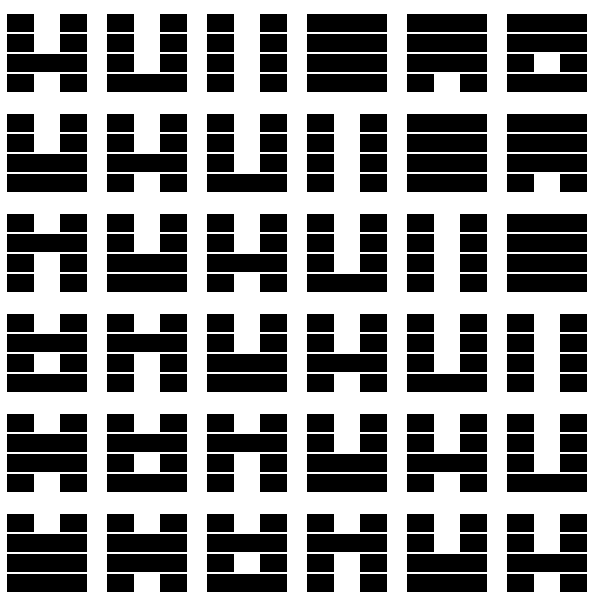

- [shader:变化的易经卦](#shader变化的易经卦)
  - [目标效果](#目标效果)
  - [实现步骤](#实现步骤)
  - [最终代码](#最终代码)
# shader:变化的易经卦
## 目标效果

## 实现步骤
1. 屏幕划块
   ```glsl
    vec2 uv=gl_FragCoord.xy/vec2(100.,100.);
    vec2 coord=floor(uv);
    uv=fract(uv);
   ```
2. 易经卦绘制  
   这是画卦象中一横,对应(0.1,0.9)*(index*0.2+0.11,index*0.29)区域,其中index为第index条，value用于控制最终卦象，pindex为2^index(插件支持shader版本过低，不能用移位运算)
   ```glsl
    float bar(vec2 uv,float value,int index,float pindex){
        float up=float(index)*.2+.11;
        float res=1.-step(up,uv.y)+step(up+.18,uv.y);// 限制竖方向显示范围
        res+=(step(.37,uv.x)-step(.63,uv.x))*(mod(floor(value/pindex),2.));// 决定中间是否需要留空
        res+=1.-step(.1,uv.x)+step(.9,uv.x);// 限制横方向显示范围
        return res;
    }
   ```
   总共需要画四条横
   ```glsl
    float tail=coord.x+coord.y+floor(u_time);
    float value=bar(uv,tail,0,1.);
    value*=bar(uv,tail,1,2.);
    value*=bar(uv,tail,2,4.);
    value*=bar(uv,tail,3,8.);
    gl_FragColor=vec4(vec3(value),1.);
   ```
## 最终代码
```glsl
#ifdef GL_ES
precision mediump float;
#endif

uniform vec2 u_resolution;
uniform vec2 u_mouse;
uniform float u_time;

float bar(vec2 uv,float value,int index,float thred){
    float up=float(index)*.2+.11;
    float res=1.-step(up,uv.y)+step(up+.18,uv.y);
    res+=(step(.37,uv.x)-step(.63,uv.x))*(mod(floor(value/thred),2.));
    res+=1.-step(.1,uv.x)+step(.9,uv.x);
    return res;
}

void main(){
    vec2 uv=gl_FragCoord.xy/vec2(100.,100.);
    vec2 coord=floor(uv);
    uv=fract(uv);
    float tail=coord.x+coord.y+floor(u_time);
    float value=bar(uv,tail,0,1.);
    value*=bar(uv,tail,1,2.);
    value*=bar(uv,tail,2,4.);
    value*=bar(uv,tail,3,8.);
    gl_FragColor=vec4(vec3(value),1.);
}
```