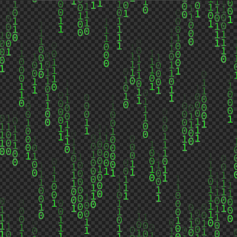
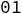
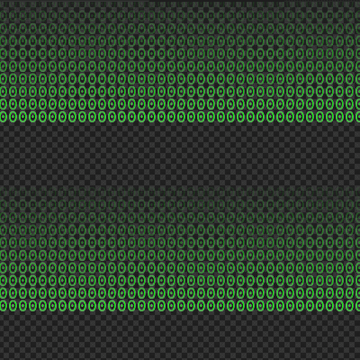

- [Shader:数字雨](#shader数字雨)
  - [目标效果](#目标效果)
  - [实现步骤](#实现步骤)
  - [最终代码](#最终代码)
# Shader:数字雨
## 目标效果

## 实现步骤
直接绘制数字过于麻烦，所以使用了纹理。如图:  
  
由于资源颜色和需要的不一致，最后输出时有部分调整。
```glsl
color.a*=(1.-color.r);
color.g+=1.;
```
1. 首先实现没有随机的效果  
    ```glsl
    float speed=10.;    // 下落速度
    float fade=10.;     // 消逝速度 
    float cycle=15.;    // 出现周期
    float offset=0.;    // 预偏移
    float index=0.;     // 数字对应下标
    vec2 uv=(gl_FragCoord.xy+vec2(0.,speed*u_time+offset))/vec2(11.,14.);
    vec2 coord=floor(uv);
    uv=fract(uv);
    vec4 color=texture2D(u_texture_0,vec2((uv.x+index)/2.,uv.y));
    color.a*=(1.-color.r)*(1.-1./fade*mod(coord.y+.01,cycle));
    color.g+=1.;
    gl_FragColor=color;
    ```
    先划块(注意算上Y移动带来的偏移),然后对纹理取样(注意X上0对应0.-.5,1对应.5-1.)，最后对alpha乘上一个有消逝速度和周期的系数。(多加.01时为了防止精度误差影响效果)   
    效果：  
      
2. 加上随机
    1. 随机函数
        ```glsl
        float rand(float value){
            return fract(sin(value*127.1452)*43758.5453123);
        }
        ```
        函数中的两个数字时随便选的，用来调整随机效果。
    2. 随机
        对不加随机的代码中的五个常量加上随机取值即可。
        但注意前四个常量中的随机子(即随机函数参数)中需要分别在同一列中保持一致。index需要在同一个数字中保持一致。
## 最终代码
```glsl
#ifdef GL_ES
precision mediump float;
#endif

uniform vec2 u_resolution;
uniform vec2 u_mouse;
uniform float u_time;
uniform sampler2D u_texture_0;

float rand(float value){
    return fract(sin(value*127.1452)*43758.5453123);
}

void main(){
    float speed=100.+250.*rand(floor(gl_FragCoord.x/11.));
    float fade=5.+5.*rand(floor(gl_FragCoord.x/11.)+.1);
    float cycle=10.+15.*rand(floor(gl_FragCoord.x/11.)+.2);
    float offset=rand(floor(gl_FragCoord.x/11.)+.3)*250.;
    vec2 uv=(gl_FragCoord.xy+vec2(0.,speed*u_time+offset))/vec2(11.,14.);
    float coordY=floor(uv.y);
    float index=floor(rand(coordY+floor(u_time*2.))*2.);
    uv=fract(uv);
    vec4 color=texture2D(u_texture_0,vec2((uv.x+index)/2.,uv.y));
    color.a*=(1.-color.r)*(1.-1./fade*mod(coordY+.01,cycle));
    color.g+=1.;
    gl_FragColor=color;
}
```