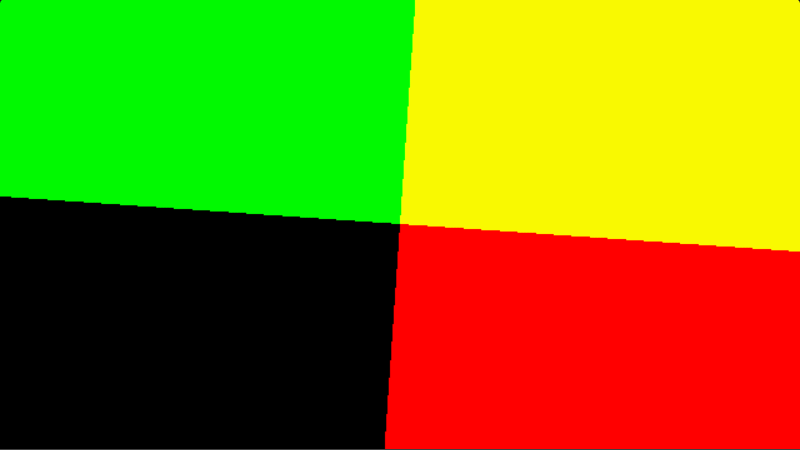
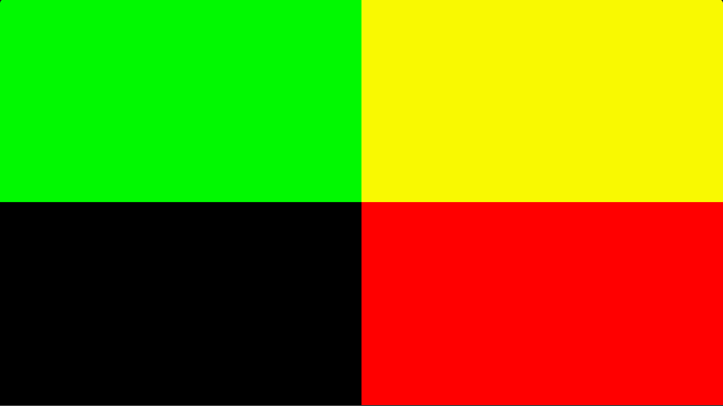
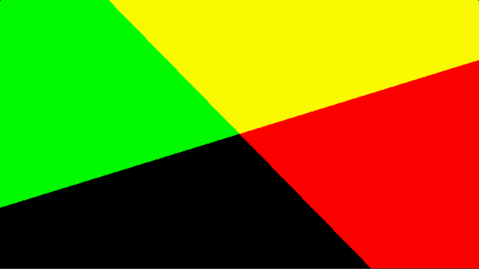

- [Shadertoy:旋转的色块](#shadertoy旋转的色块)
  - [目标效果:](#目标效果)
  - [实现步骤:](#实现步骤)
  - [结尾](#结尾)
# Shadertoy:旋转的色块
## 目标效果:

## 实现步骤:
1. 划块
```glsl
    float n = 2.0;
    uv = floor(uv * n) / (n - 1.0);   // 就是这么简单
```
  
2. 旋转
```glsl
    vec2 offset = vec2(0.5, 0.5);
    uv -= offset;  // 将中心切换至原点
    uv = cos(angle) * uv + sin(angle) * vec2(uv.y, -uv.x); // 旋转angle
    uv += offset;  // 平移会原来的位置
```
或者是
```glsl
   uv = cos(angle) * vec2(uv.x - 0.5, uv.y - 0.5) + 
        sin(angle) * vec2(uv.y - 0.5, 0.5 - uv.x) +
        vec2(0.5, 0.5); 
```
  
图中绿色的噪点是我录频软件的问题  
3. 结合(1),(2)(先旋转,再划块)  
  
w(ﾟДﾟ)w,色块之间夹角居然没有保持直角  
4. 最后调整
夹角没有成直角的原因是uv的长宽一致而屏幕的长宽不一致,相当于向两侧拉伸。我采用的解决方法就是用一个大的方形包住屏幕,将UV从屏幕转换到方形中计算效果。为了旋转到45度时方形也能包住屏幕,方形的边长选择为屏幕的对角线长度。
```glsl
    float len = length(iResolution.xy); // 获得屏幕对角线的长度
    vec2 padding = (len - iResolution.xy) / 2.0; // 获得x,y方向上相对于整个方形的的偏移
    vec2 uv = (fragCoord + padding) / len;  // 获得当前色块在方形上的UV
```
## 结尾
由于只是简单的输出了uv的值,所以图显得单调而且无聊。  
尝试了一下将n调大的效果。
  
悄悄告诉你,如果你盯着那张角度变化的图看久了,再看角度不变的图片,会有他角度也在变化的错觉,我特意拿了方的东西到屏幕前比了一下才确定最后的成品是直角。
