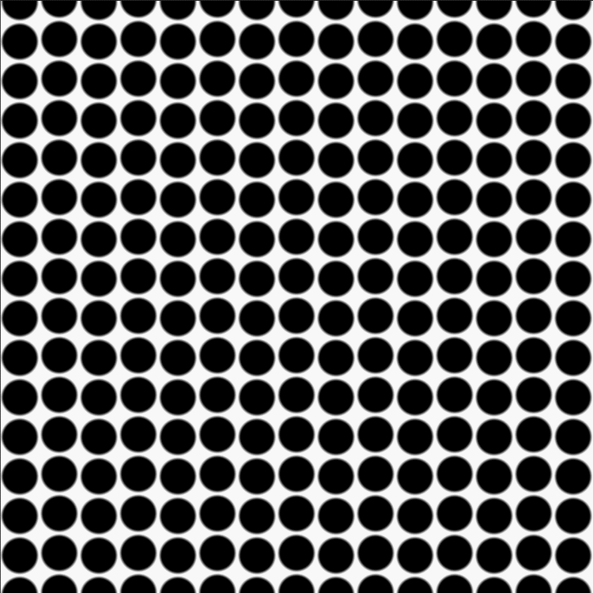
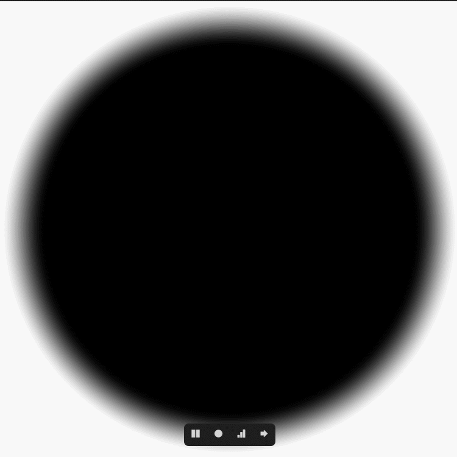
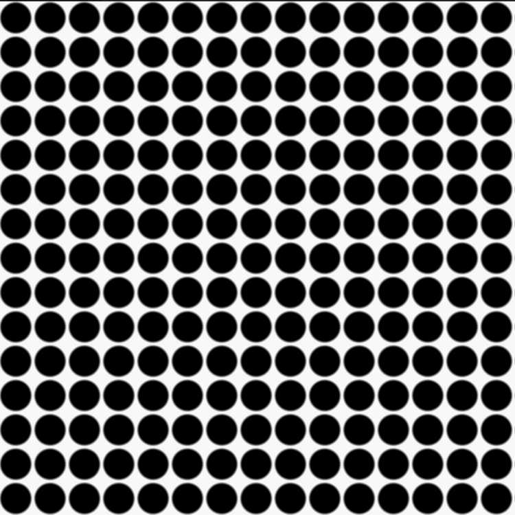
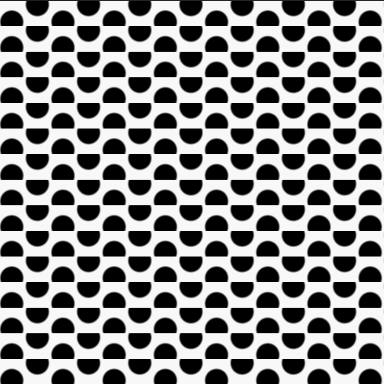
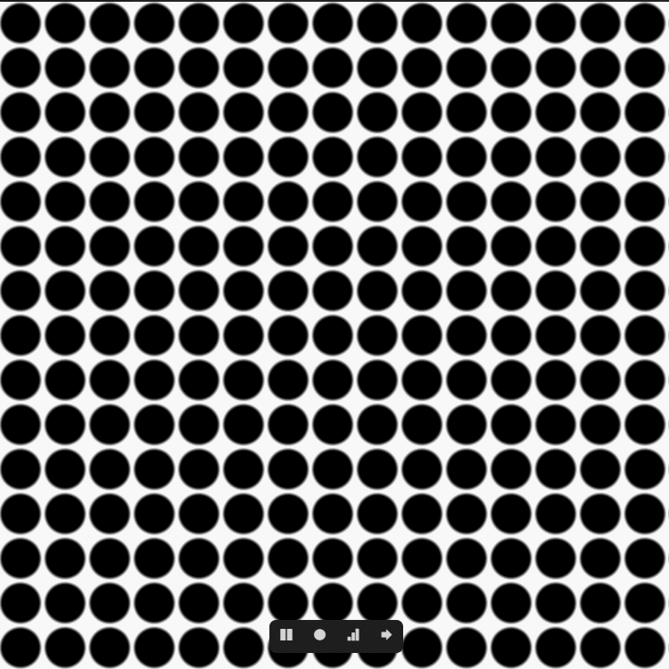
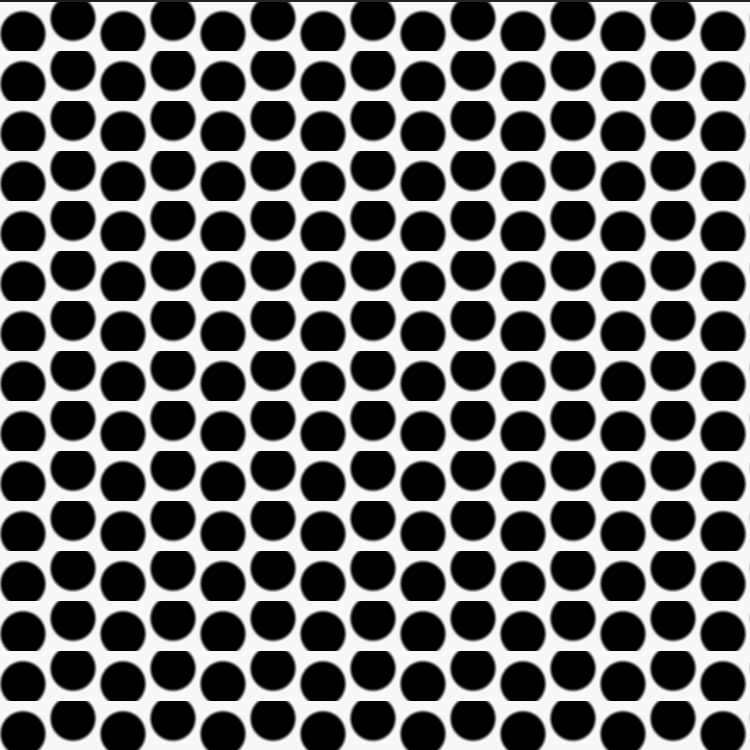

- [Shader:移动的圆](#shader移动的圆)
  - [前言](#前言)
  - [目标效果](#目标效果)
  - [实现步骤](#实现步骤)
    - [最终代码](#最终代码)
# Shader:移动的圆
## 前言
忽然在vscode中发现glsl-canvas插件用来练习shader很方便，不用上网等shadertoy界面加载了。
## 目标效果

## 实现步骤
1. 在$(0,1)*(0,1)$空间画圆
```glsl
float circle(vec2 uv,vec2 center){
    return smoothstep(.4,.5,length(uv-center));
...
float value=circle(uv,center);
gl_FragColor=vec4(vec3(value),1.);
...
}
```

其中:
* uv是$(0,1)*(0,1)$空间uv
* center是圆心对应位置
* $.4$,$.5$影响的是圆的半径
  
2. 屏幕划块
```glsl
vec2 uv=gl_FragCoord.xy/vec2(50.,50.);
vec2 coord=floor(uv);
uv=fract(uv);
```

其中:
* $50.$指划块时的边长
* uv就是每一小块中$(0,1)*(0,1)$空间uv
* coord就是每一小块的坐标
  
3. 移动
   1. 初始化圆心
    ```glsl
    vec2 center=vec2(.5,.5);
    ```  
   2. 错行移动
   ```glsl
    center.y+=(mod(coord.x,2.)*2.-1.)*fract(u_time);
   ```
    
   其实就是按小块x坐标奇偶对应$1.$，$-1.$来乘上时间小数部分来移动，这样奇数行和偶数行就能反向移动。  
   3. 时间交错
   ```glsl
    // center.y+=(mod(coord.x,2.)*2.-1.)*fract(u_time);
    center.y+=mod(floor(u_time),2.)*(mod(coord.x,2.)*2.-1.)*fract(u_time);
   ```
    
   按类似错行移动的逻辑，将时间的整数部分按奇偶对应$1.$,$2.$，就能实现$y$只在奇数时间内发生移动。
   同理:
   ```glsl
    center.x+=mod(floor(u_time)+1.,2.)*(mod(coord.y,2.)*2.-1.)*fract(u_time);
   ```
    
   计算$x$的位移时，对时间多$+1.$实现$x$只在偶数时间内发生移动。  
   4. 补上缺失的圆  
    现在圆内正常移动了，但是会在移除格子外消失，因为我们只在格子中画了一个圆。为了让动画开起来连续，就需要在移动的反方向补上一个圆。
    ```glsl
    vec2 center2;
    center2.y=center.y-mod(floor(u_time),2.)*(mod(coord.x,2.)*2.-1.);
    center2.x=center.x-mod(floor(u_time)+1.,2.)*(mod(coord.y,2.)*2.-1.);
    ```
   5. 合并圆  
    由于我画的是黑圆，相当于从中扣了一个圆，所以合并需要用乘。  
    如果需要画的是周围黑，中间亮的圆，合并需要用加。
### 最终代码
```glsl
#ifdef GL_ES
precision mediump float;
#endif

uniform vec2 u_resolution;
uniform vec2 u_mouse;
uniform float u_time;

float circle(vec2 uv,vec2 center){
    return smoothstep(.4,.5,length(uv-center));
}

void main(){
    vec2 uv=gl_FragCoord.xy/vec2(50.,50.);
    vec2 coord=mod(floor(uv),2.)*2.-1.;
    vec2 center=vec2(.5,.5);
    vec2 center2;
    uv=fract(uv);
    vec2 timeMod=mod(floor(vec2(u_time)+vec2(0.,1.)),2.);
    vec2 scale=coord*timeMod;
    center.y+=scale.x*fract(u_time);
    center2.y=center.y-scale.x;
    center.x+=scale.y*fract(u_time);
    center2.x=center.x-scale.y;
    float value=circle(uv,center);
    value*=circle(uv,center2);
    gl_FragColor=vec4(vec3(value),1.);
}
```